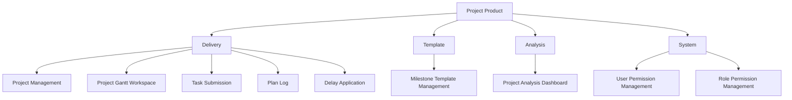
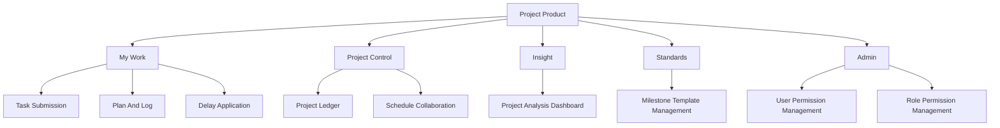

# Project Information Architecture V1

This document converts the week-1 project analysis into an explicit IA proposal for the `project` product inside Portal.

---

## 1. IA Goal

Shift the current product from:

- a feature-oriented workspace collection

to:

- a role-aware project workbench

---

## 2. Current IA

Current workspace set:

Problem:

- structurally valid
- mentally fragmented

---

## 3. Proposed IA

---

## 4. Why This IA Is Better

### My Work

Audience:

- project member
- project manager in execution mode

Reason:

- combines all "I need to do/report/apply" actions

### Project Control

Audience:

- PMO
- project manager
- viewer

Reason:

- contains portfolio and control surfaces

### Insight

Audience:

- PMO
- viewer
- project manager

Reason:

- isolates analysis from execution

### Standards

Audience:

- PMO
- template owner

Reason:

- keeps configuration out of day-to-day flow

### Admin

Audience:

- admin only

Reason:

- removes high-risk settings from the main work path

---

## 5. Role-Based Landing Rules

| Role | Default Landing | Secondary Focus |
| --- | --- | --- |
| PMO | Project Ledger | Insight / Standards |
| Project Manager | Schedule Collaboration | Project Ledger / My Work |
| Project Member | Task Submission | Plan And Log / Delay Application |
| Viewer | Project Analysis Dashboard | Project Ledger |
| Super Admin | Project Ledger | Admin / Standards |

---

## 6. Navigation Recommendations

### First-Level Navigation

Show only:

- My Work
- Project Control
- Insight
- Standards
- Admin

### Second-Level Navigation

Show actual workspace pages under the selected group.

### Recommended Labels

| Current Label | Recommended Label |
| --- | --- |
| Project Management | Project Ledger |
| Project Gantt Workspace | Schedule Collaboration |
| Task Submission | Task Submission |
| Plan Log | Plan And Log |
| Delay Application | Delay Application |
| Milestone Template Management | Milestone Templates |
| Project Analysis Dashboard | Project Analysis Dashboard |
| Project User Permission Management | User Permissions |
| Project Role Permission Management | Role Permissions |

---

## 7. Navigation Behavior Recommendations

1. Default landing should be role-sensitive.
2. Admin and Standards should be visually lower-priority than execution work.
3. Open tabs should be limited to meaningful user workflows.
4. The current selected project context should remain visible in the shell.

---

## 8. IA Risks To Confirm

1. Whether PMO should keep direct access to execution workspaces.
2. Whether viewers should land on dashboard or ledger by default.
3. Whether template and permission areas should stay inside the project product or move toward platform admin later.

---

## 9. Recommended Next Design Targets

Design in this order:

1. Project shell using the new IA
2. Project Ledger
3. Schedule Collaboration
4. My Work entry experience
