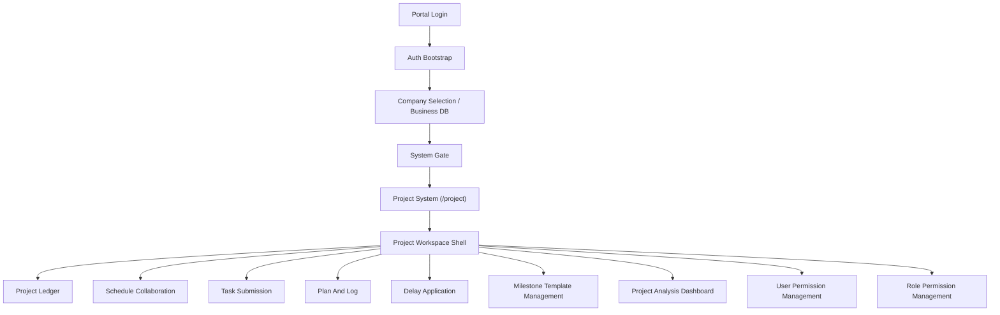
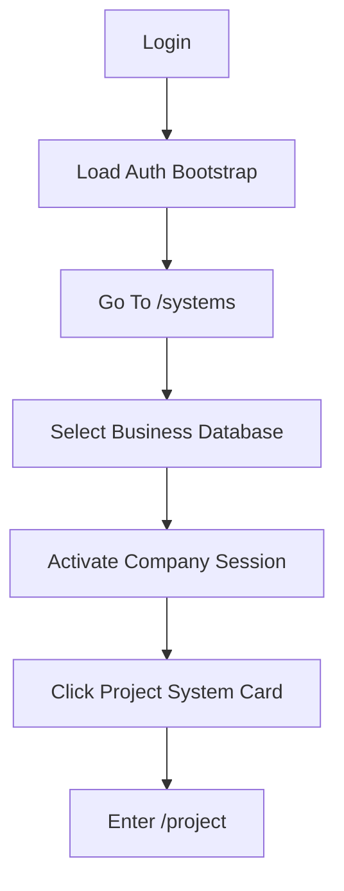
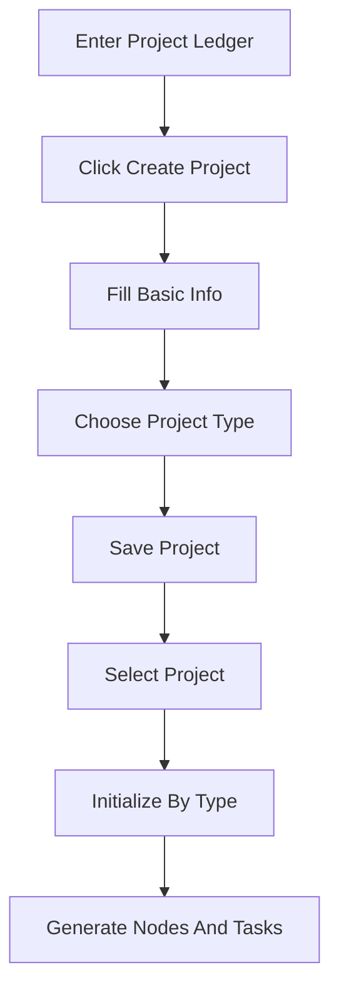
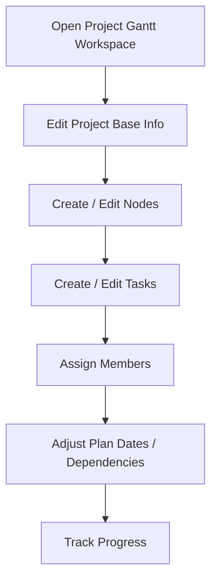
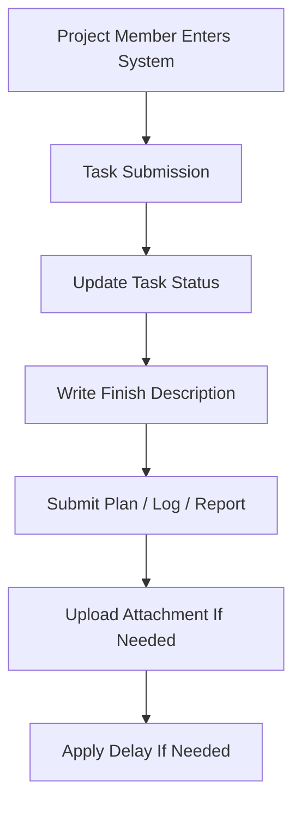
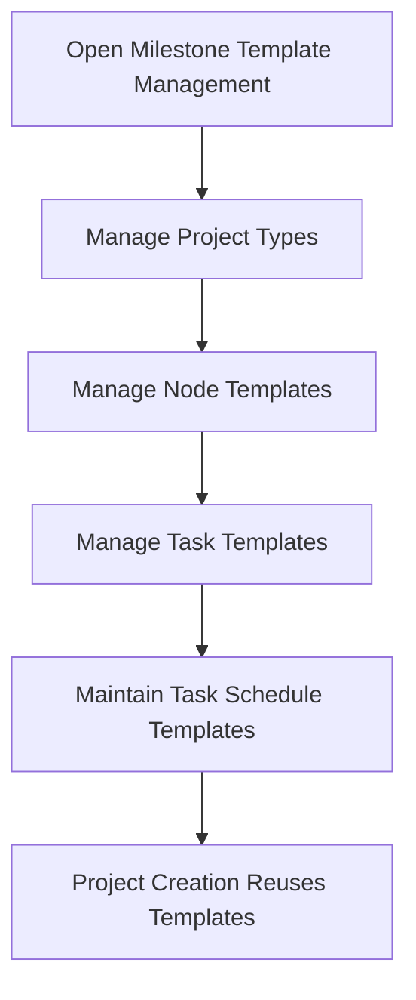

# Project PM/UI Week 1 Kit

This document is the week-1 takeover kit for a hybrid UI designer + product manager role on the `LsERPPortal` project workspace.

It is intentionally practical:

- what the current system is
- how the project product is structured
- who uses it
- which flows matter first
- where the current UX/product risks are
- what should be changed next

---

## 1. Scope And Goal

This kit focuses on the `project` product inside the Portal mother shell, not on the whole codebase equally.

Current product chain:

1. Portal login
2. Company/database selection
3. System gate
4. Enter `/project`
5. Work inside the project workspace

Week-1 goal is not "finish redesign".

Week-1 goal is:

1. build a correct system map
2. clarify role and permission logic
3. sort the core business flows
4. identify the main UX and product risks
5. produce a first information architecture direction

---

## 2. System Map

### 2.1 Product Layers

The current platform should be understood as three layers:

1. Portal layer
   - login
   - auth bootstrap
   - company session
   - system gate
   - route guard
2. Product layer
   - `designer`
   - `erp`
   - `project`
   - `bi`
   - `bi-display`
3. Business workspace layer inside each product
   - the `project` system already has multiple internal workspaces

### 2.2 Current Entry Structure



### 2.3 Key Source Files

Portal layer:

- `apps/portal/src/router.tsx`
- `apps/portal/src/pages/system-access-page-view.tsx`
- `apps/portal/src/features/auth/services/portal-bootstrap-service.ts`
- `packages/schema/contracts/src/index.ts`

Project product layer:

- `packages/products/project/src/index.tsx`
- `packages/products/project/src/project-workspace-config.ts`
- `packages/products/project/src/project-workspace-shell.tsx`
- `packages/products/project/src/project-permissions.ts`

Backend project domain:

- `lserp-module-project/src/main/java/com/lserp/module/project/...`

---

## 3. What The Screenshot Page Actually Is

The screenshot page is not the project management product homepage.

It is the system gate page.

Its real responsibilities are:

1. show accessible business databases / companies
2. force the user to activate one company session first
3. show the systems the user may enter
4. route the user into the chosen product

This means the red-circled "Project Management System" card is only a product entrance card.

From a product perspective, this page mixes two different decisions:

1. "Which business database am I working in?"
2. "Which system do I want to enter?"

That is one of the biggest current UX burdens.

---

## 4. Current Project Product Structure

### 4.1 Workspace Inventory

The current `project` product already has these workspaces:

| Group | Workspace | Purpose |
| --- | --- | --- |
| Delivery | Project Management | project master record / ledger |
| Delivery | Project Gantt Workspace | schedule and node/task coordination |
| Delivery | Task Submission | member execution and task updates |
| Delivery | Plan Log | plan, summary, log, report collaboration |
| Delivery | Delay Application | delay-related handling |
| Template | Milestone Template Management | project type / node / task template config |
| Analysis | Project Analysis Dashboard | analysis center, still relatively planning-oriented |
| System | Project User Permission Management | user-based permission management |
| System | Project Role Permission Management | role-based permission management |

### 4.2 Structural Interpretation

This is not a "single page project system".

It is already a medium-sized product with four internal zones:

1. project execution
2. template configuration
3. analysis
4. system permission management

The current design problem is not lack of functions.

The current design problem is that the internal mental model is still too tool-centric, not role-centric.

---

## 5. Role Matrix

### 5.1 Current Role Logic

Front-end role recognition currently comes from text matching in `project-permissions.ts`.

Current effective role categories:

- super admin
- PMO
- project manager
- project member
- viewer

### 5.2 Current Role To Workspace Mapping

| Role | Visible Workspaces | Product Meaning |
| --- | --- | --- |
| Super Admin | all workspaces | platform-level control |
| PMO | almost all non-admin workspaces | operational/project governance role |
| Project Manager | management, gantt, submission, plan log, delay, analysis | project owner role |
| Project Member | submission, plan log, delay | execution role |
| Viewer | management, analysis | read-only role |

### 5.3 Recommended Role View Model

For product and UI work, the system should be re-understood as four entry experiences:

1. PMO view
   - portfolio visibility
   - template governance
   - schedule control
   - permission governance
2. Project Manager view
   - project ledger
   - planning and scheduling
   - member assignment
   - report and delivery progress
3. Project Member view
   - my tasks
   - my plan/log
   - my delay requests
4. Viewer view
   - project status
   - dashboard
   - read-only records

### 5.4 Week-1 Conclusion On Roles

The current workspace menu is function-driven.

The next design stage should make the experience role-driven.

That does not necessarily require deleting workspaces.

It does require:

1. better defaults by role
2. better naming
3. better grouping
4. clearer landing page priorities

---

## 6. Core Business Flows

### 6.1 Flow A: Enter Project System



Design/product note:

- this is a gated entry flow
- entry is blocked without company session
- users need clearer explanation of why the company step comes first

### 6.2 Flow B: Create A Project



Design/product note:

- project type selection is structurally important
- initialization by type is a critical milestone action
- the create flow should explicitly communicate that the project is not truly ready until initialized

### 6.3 Flow C: Schedule And Delivery Coordination



Design/product note:

- this is likely the manager's main workspace
- its information density is naturally high
- it needs strong hierarchy and progressive disclosure

### 6.4 Flow D: Member Execution



Design/product note:

- members do not need full project control
- they need a narrow, obvious, action-first interface
- current product architecture should support a "My Work" mental model better than it currently does

### 6.5 Flow E: Template Governance



Design/product note:

- template management is configuration-heavy
- it should probably be visually and navigationally separated from daily execution work

---

## 7. Current Product And UX Risks

### 7.1 Entry Layer Risks

1. Business database selection and system selection are mixed on one page.
2. New users may not understand why system entry is blocked before company selection.
3. System card copy is more platform-internal than task-oriented.
4. The Project card communicates product category, but not user value or likely next actions.

### 7.2 Navigation Risks

1. The current project menu is function-complete but not role-prioritized.
2. Too many workspaces share the same structural weight.
3. "Analysis" and "System" items visually compete with daily execution items.
4. Tabs can accumulate, but not every workspace deserves equal tab behavior.

### 7.3 Mental Model Risks

1. "Project Management", "Schedule Collaboration", "Task Submission", "Plan Log", and "Delay Application" are logically connected but currently feel like separate tools.
2. The product does not yet present a clear "manager home" versus "member home".
3. Initialization-by-template is critical, but product messaging around it is weak.

### 7.4 Permission Risks

1. Front-end role recognition currently relies on role text matching.
2. If backend role naming changes, visible workspace behavior can drift.
3. Portal bootstrap fallback currently infers grants locally when the server payload fails.
4. This means permission experience should be treated as a design and product risk, not just a technical detail.

### 7.5 Content And Language Risks

1. Some copy is abstract and platform-facing instead of user-facing.
2. There is visible mixed language usage.
3. Some mojibake/encoding issues exist in source text and should be treated as a product quality issue, not just a code issue.

### 7.6 Delivery Risks

1. Backend module coverage is broad, but automated tests are relatively weak outside attachment-related code.
2. The front-end `project` entry file is already quite large, which increases future design/dev coordination cost.
3. Local development depends on real SQL Server access and company-session switching, so design validation must consider data context.

---

## 8. Recommended Information Architecture V1

### 8.1 Product-Level Recommendation

Do not redesign the project product as a flat workspace grid.

Redesign it as a role-sensitive workbench.

### 8.2 Recommended Navigation Groups

Recommended internal grouping:

| Recommended Group | Workspaces |
| --- | --- |
| My Work | Task Submission, Plan Log, Delay Application |
| Project Control | Project Ledger, Schedule Collaboration |
| Standards | Milestone Template Management |
| Insight | Project Analysis Dashboard |
| Admin | User Permission Management, Role Permission Management |

### 8.3 Recommended Role Defaults

| Role | Default Landing |
| --- | --- |
| PMO | Project Ledger |
| Project Manager | Schedule Collaboration |
| Project Member | Task Submission |
| Viewer | Project Analysis Dashboard or Project Ledger |

### 8.4 Why This IA Is Better

1. it aligns with role intent
2. it reduces first-step confusion
3. it makes execution work more direct
4. it moves admin/config areas out of the main daily path

---

## 9. Page-Level Design Priorities

### P0

These should be designed first:

1. system gate page
2. project workspace shell / left navigation
3. project ledger
4. schedule collaboration

### P1

These should follow:

1. task submission
2. plan log
3. delay application

### P2

These can follow later:

1. analysis dashboard
2. user permission management
3. role permission management
4. template governance refinement

---

## 10. First Design Direction

### 10.1 System Gate Page

Current page intent:

- choose company
- choose system

Recommended redesign direction:

1. turn the left side into a clear "current business context" panel
2. explain why company selection is required before system entry
3. make the right-side system cards more task-oriented
4. visually separate "available but locked until company selected" from "ready to enter"

Suggested card copy direction for Project:

- title: `Project Management System`
- support text: `Open project ledger, schedule collaboration, execution tracking, and delivery reporting.`

### 10.2 Project Product Shell

Recommended shell priorities:

1. stronger role-aware landing
2. more obvious current project context
3. less competition between admin/config and daily work
4. better tab policy

### 10.3 Project Ledger

This page should be treated as:

- portfolio entry for PMO
- project archive and selection hub for managers
- read-only lookup page for viewers

It should clearly show:

1. project identity
2. project status
3. project manager
4. time range
5. budget
6. initialization status

### 10.4 Schedule Collaboration

This page is likely the main manager cockpit.

It should prioritize:

1. current project summary
2. node/task timeline
3. assignment clarity
4. progress bottlenecks
5. dependency impact

### 10.5 Member Workspaces

Task Submission, Plan Log, and Delay Application should be reframed together as "My Work".

That creates a more natural member experience:

- what I need to do
- what I need to report
- what I need to apply for

---

## 11. Low-Fidelity Direction

### 11.1 System Gate Page Wireframe

```text
+---------------------------------------------------------------+
| Header: current user / system admin / context                 |
+---------------------------+-----------------------------------+
| Business Context Panel    | Available Systems                 |
| - Current company         | - Project                         |
| - Why company matters     | - ERP                             |
| - Company switch list     | - Designer                        |
| - Current status          | - BI                              |
| - Continue hint           |                                   |
+---------------------------+-----------------------------------+
```

### 11.2 Project Product Shell Wireframe

```text
+---------------------------------------------------------------+
| Top bar: product / current workspace / current project        |
+----------------------+----------------------------------------+
| Left nav             | Main workspace area                    |
| - My Work            |                                        |
| - Project Control    | Selected workspace content             |
| - Insight            |                                        |
| - Standards          |                                        |
| - Admin              |                                        |
+----------------------+----------------------------------------+
```

### 11.3 Role-Based Landing Concept

```text
PMO -> portfolio and control first
Manager -> active project scheduling first
Member -> my tasks first
Viewer -> overview first
```

---

## 12. Backend And Data Constraints

These constraints must be understood before redesign decisions are finalized.

1. The backend uses SQL Server.
2. Company context is not cosmetic; it drives whole-database switching.
3. Dynamic datasource behavior is part of the product model.
4. The project backend already exposes broad domain APIs, so many improvements can be front-end/product-first before requiring major backend redesign.

Practical implication:

- always treat "selected business database" as a first-class UX context
- do not design cross-company assumptions into project views
- treat empty states carefully because "no data" may mean "wrong company context"

---

## 13. Week-1 Deliverables Checklist

This kit completes most of the week-1 analytical deliverables in document form.

Delivered here:

- system map
- role matrix
- core flow summary
- issue list
- IA recommendation
- first low-fidelity direction

Still recommended as next practical assets:

1. Figma version of the system gate page
2. Figma version of the project shell
3. role-based landing page variants
4. page-state inventory for each core workspace

---

## 14. Suggested Week-2 Start

Recommended immediate next step:

1. confirm role defaults
2. confirm IA regrouping
3. redesign system gate page
4. redesign project workspace shell
5. redesign project ledger as the first high-value business page

If design and product resources are combined in one role, the most efficient sequence is:

1. IA and role model confirmation
2. low-fidelity workflow
3. high-fidelity shell and ledger
4. development handoff in batches

---

## 15. Short Executive Summary

This project is already beyond the "concept" stage.

The main challenge is no longer feature existence.

The main challenge is aligning:

- platform entry
- business context selection
- role-aware navigation
- project execution workflows
- configuration and admin capabilities

The project system should now evolve from "workspace collection" into a "role-aware project workbench".
