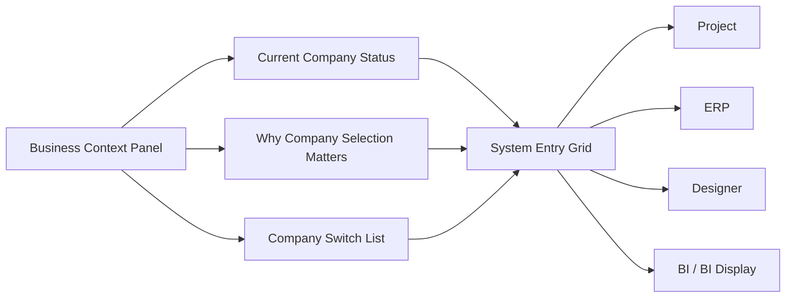

# System Gate Redesign Brief V1

This brief focuses on the Portal system gate page, the page shown after login and before entering a product such as `project`, `erp`, `designer`, or `bi`.

Current implementation reference:

- `apps/portal/src/pages/system-access-page-view.tsx`
- `apps/portal/src/router.tsx`
- `packages/schema/contracts/src/index.ts`

---

## 1. Why This Page Matters

This page is the first real "working" page after login.

It currently carries two responsibilities at the same time:

1. select the current business database / company context
2. choose which system to enter

That makes it one of the most important pages in the entire platform.

If this page is unclear, the user will misunderstand:

- why access is blocked
- why company selection is required
- what each system is for
- what to click next

---

## 2. Page Goal

The page should help the user do one thing clearly:

> confirm the correct business context, then enter the correct system.

The page should not feel like a brand showcase.

It should feel like a controlled launchpad for work.

---

## 3. Primary User Questions

The page must answer these questions immediately:

1. Which company / business database am I currently in?
2. Why do I need to select a company first?
3. Which systems can I enter with my current account?
4. Which system should I go to for my current task?
5. Why is a system unavailable or locked?

---

## 4. Current Problems

### 4.1 Product Problems

1. Business context and system selection are visually adjacent but conceptually different.
2. The page explains too little about why company selection is mandatory.
3. System cards are more like category cards than decision cards.
4. The page does not help role-based decision making.

### 4.2 UX Problems

1. The left side behaves like context setup, but the right side competes for attention immediately.
2. The "locked until company selected" behavior exists, but the reason is not emphasized enough.
3. The user must infer too much:
   - "What is a business database?"
   - "Will switching company affect my data?"
   - "What happens after I click Project?"

### 4.3 Content Problems

1. Some descriptions are platform-facing and abstract.
2. The system cards are visually clean, but not task-specific enough.
3. The page needs more action-oriented copy.

---

## 5. Redesign Principles

1. Context first, system second.
2. Explain before blocking.
3. Show readiness clearly.
4. Use task-oriented copy.
5. Keep the page simple enough for first-time users.

---

## 6. Recommended Page Structure



### 6.1 Left Panel: Business Context

Purpose:

- establish current working context
- explain dependency
- let the user switch company

Recommended blocks:

1. Current business context
2. Why this matters
3. Current status message
4. Available companies

### 6.2 Right Panel: System Entry

Purpose:

- show available systems
- show entry readiness
- help the user choose the next tool

Recommended behavior:

- disabled if no company session
- enabled after company activation
- each card should explain what the user can do there

---

## 7. Recommended Information Hierarchy

### Level 1

- current company status
- current user can enter these systems

### Level 2

- why company selection is required
- which systems are available

### Level 3

- detailed system description
- lower-priority admin action such as system management

---

## 8. Proposed Wireframe

```text
+----------------------------------------------------------------------------------+
| top right: system management / account / status                                  |
+----------------------------------+-----------------------------------------------+
| LEFT: BUSINESS CONTEXT           | RIGHT: ENTER A SYSTEM                         |
|----------------------------------|-----------------------------------------------|
| label: Current Business Context  | title: Choose A System                        |
| company name / current status    | helper: enter the correct system after        |
| success or warning banner        | business context is confirmed                 |
|----------------------------------|-----------------------------------------------|
| why this matters                 | [Project] [ERP]                               |
| "data, permissions, projects,    | [Designer] [BI]                              |
| and records depend on company"   | [BI Display]                                  |
|----------------------------------|                                               |
| company switch list              | each card shows:                              |
| - current company                | - title                                       |
| - other companies                | - task-based description                      |
| - switching state                | - ready / locked state                        |
|                                  | - action hint                                 |
+----------------------------------+-----------------------------------------------+
```

---

## 9. Recommended Content Direction

### 9.1 Left Panel Copy Direction

Current section meaning:

- "choose company first"

Recommended content direction:

- Title: `Current Business Context`
- Helper copy:
  `Projects, permissions, and business records depend on the selected company database. Confirm the correct context before entering a system.`

### 9.2 Status Messaging

Before company is selected:

- `Choose a business context before entering a system.`

After company is selected:

- `Business context confirmed. You can now enter a system.`

During switching:

- `Switching business context...`

### 9.3 Project Card Copy Recommendation

Current direction:

- too generic

Recommended direction:

- Title: `Project Management System`
- Description:
  `Open project ledger, schedule collaboration, task execution, reports, and delivery follow-up.`

### 9.4 ERP Card Copy Recommendation

- Title: `ERP Platform`
- Description:
  `Handle business operations, runtime workflows, and execution tasks tied to the current company context.`

### 9.5 Designer Card Copy Recommendation

- Title: `Design Platform`
- Description:
  `Design metadata, preview configurations, and manage platform-facing structure rules.`

### 9.6 BI Card Copy Recommendation

- Title: `BI Analysis Platform`
- Description:
  `Review dashboards, metrics, and analysis views for the selected business context.`

---

## 10. Interaction Rules

### 10.1 Company Selection

If no company is active:

- all system cards remain visibly present
- cards show locked state
- clicking a card should explain the reason, not silently fail

If company activation succeeds:

- current company state updates immediately
- success feedback appears
- system cards become enterable

### 10.2 System Entry

If a system is available and company is active:

- card click enters the route immediately

If a system is granted but company is not active:

- card click keeps the user on the page
- banner explains: company selection required

If a system is not granted:

- do not show it in the main entry grid

### 10.3 Admin Entry

System management should remain available to admins, but it should not dominate the page.

Recommended placement:

- top-right utility action
- visually secondary

---

## 11. Required Page States

The redesign must define all of these states explicitly.

### 11.1 Loading States

1. company list loading
2. company switching in progress

### 11.2 Success States

1. company selected successfully
2. system ready to enter

### 11.3 Warning States

1. no company selected
2. systems visible but locked

### 11.4 Error States

1. company list failed to load
2. company activation failed

### 11.5 Empty States

1. no accessible systems
2. no available companies

---

## 12. Visual Direction

This page should feel:

- calm
- trustworthy
- structured
- operational

It should feel less like a gallery of products and more like a controlled work launchpad.

### Recommended visual hierarchy

1. current company status
2. available systems
3. company switch list
4. admin / utility actions

### Recommended visual cues

1. strong success state when a company is active
2. strong warning state when company is required
3. clear difference between locked and available system cards
4. task-oriented card descriptions

---

## 13. Design Decisions To Confirm

These questions should be confirmed before final UI delivery.

1. Should the page auto-enter a default system after company selection, or always wait for explicit user choice?
2. Should the Project card be visually emphasized for users whose role is project-oriented?
3. Should the company list show more business metadata, such as environment or region?
4. Should the system cards show role-based hints like "recommended for your role"?

Recommended default answer for now:

- do not auto-enter
- keep user choice explicit

---

## 14. Suggested Deliverables

### PM Deliverables

1. page objective statement
2. user decision flow
3. state list
4. content strategy

### UI Deliverables

1. low-fidelity wireframe
2. high-fidelity page
3. state variants
4. card component spec

### Handoff Deliverables

1. interaction notes
2. copy sheet
3. loading / empty / error / success state sheet
4. acceptance checklist

---

## 15. Acceptance Checklist

The redesign is successful if:

1. users understand why company selection is required
2. users can identify the current business context immediately
3. users can identify which systems are available
4. users understand what the Project system is for before entering it
5. locked states are understandable and not frustrating
6. admin access remains available but visually secondary

---

## 16. Immediate Next Step

Recommended next action after this brief:

1. create a low-fidelity wireframe for the system gate page
2. create one alternate version with stronger Project emphasis
3. review both against the acceptance checklist
